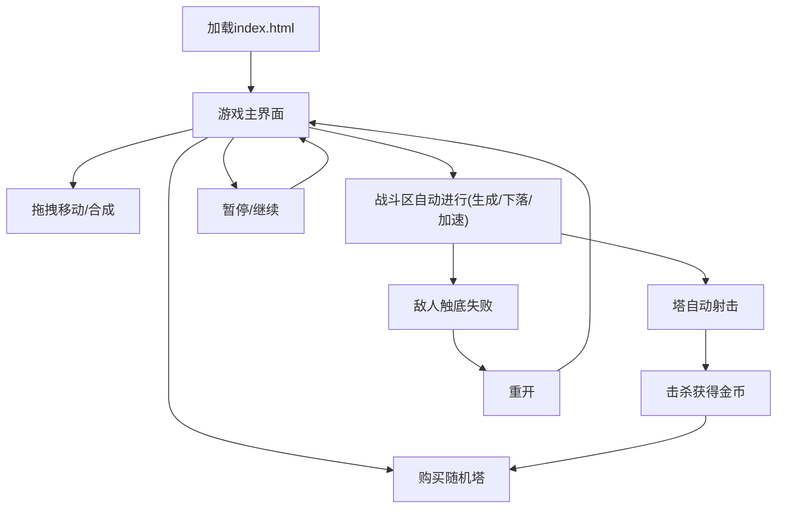

## 1. Product Overview

一款基于 HTML5 Canvas 的“割草 + 合成 + 塔防”单页小游戏。
你在下方 5x5 网格购买并合成塔，上方战斗区敌人持续下落并逐步加速，塔自动射击拦截。

## 2. Core Features

### 2.2 Feature Module

本产品为单页玩法，包含以下页面与核心模块：

1. **游戏主界面**：上方战斗区（敌人生成/下落/加速/结算），下方 5x5 塔网格（购买随机塔、拖拽移动、同级合成升级），底部 UI（货币、购买按钮、开始/暂停/重开、基础提示）。

### 2.3 Page Details

| Page Name | Module Name  | Feature description                                     |
| --------- | ------------ | ------------------------------------------------------- |
| 游戏主界面     | 游戏初始化/循环     | 初始化画布与布局；启动主循环（更新→碰撞/伤害→渲染）；支持暂停与重开                     |
| 游戏主界面     | 战斗区：敌人生成     | 按波次/时间间隔生成敌人；敌人带基础属性（生命/速度/价值）                          |
| 游戏主界面     | 战斗区：敌人移动与加速  | 敌人自上而下移动；随时间或波次提升全局下落速度（加速难度）                           |
| 游戏主界面     | 战斗区：失败与胜利/结算 | 敌人到达底线判定失败；击杀获得货币；重开恢复初始状态                              |
| 游戏主界面     | 塔网格：购买随机放塔   | 点击“购买”消耗货币；随机生成 1 个基础塔并放入空格（无空格则提示无法购买）                 |
| 游戏主界面     | 塔网格：拖拽移动     | 按住塔拖拽到目标格；空格则移动；非空且不满足合成则回弹/交换（按实现择一，需一致）               |
| 游戏主界面     | 塔网格：合成升级     | 同类型且同等级的塔拖拽到一起自动合成；生成更高等级塔并更新显示（等级/外观/数值）               |
| 游戏主界面     | 塔：自动射击       | 塔在射程内自动选择目标（最近/最前方择一）并按攻速发射子弹/射线；命中扣血                   |
| 游戏主界面     | 塔：升级收益       | 等级提升带来至少一项数值成长（伤害/攻速/射程）；保证高等级更强                        |
| 游戏主界面     | 底部 UI：信息与操作  | 展示货币、波次/时间、当前加速等级；提供购买按钮与暂停/重开；给出关键状态提示（金币不足/格子已满/合成成功） |

## 3. Core Process

* 开局后进入游戏主界面：上方战斗区开始生成敌人下落。

* 你在底部点击“购买随机塔”：若金币足够且有空格，则在 5x5 网格生成一座随机基础塔。

* 你拖拽塔进行整理：拖到空格完成移动；拖到相同类型且相同等级的塔上触发合成，生成更高等级塔。

* 塔会自动对战斗区内敌人射击：敌人被击杀获得金币，用于继续购买与合成。

* 随时间/波次敌人下落速度提升：你需要通过更高等级塔提升输出。

* 若任一敌人抵达底线则失败：可点击重开重新开始。

