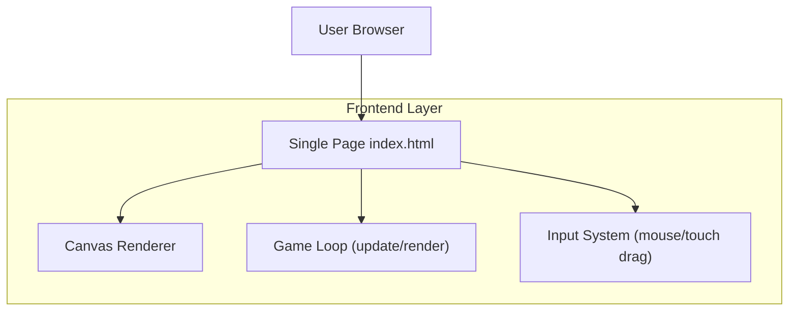

## 1.Architecture design

## 2.Technology Description
- Frontend: HTML5 + CSS3 + JavaScript (ES6) + Canvas 2D
- Backend: None

## 3.Route definitions
| Route | Purpose |
|---|---|
| / (index.html) | 单页游戏入口，承载战斗区渲染、网格交互与底部 UI |

## 6.Data model(if applicable)
本项目为纯前端本地运行，默认不包含持久化数据模型（可选：使用 localStorage 保存基础设置/最高波次，但不作为必需功能）。